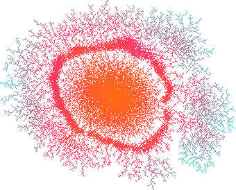

DLA Studio
===========

This is a UI for exploring [Diffusion-Limited Aggregation](https://en.wikipedia.org/wiki/Diffusion-limited_aggregation)




# Run Local

```
npm install
npm run dev
```

# Deploy

run: `npm run deploy` 

This is hosted on github pages at https://dlastudio.org

The run command will build, commit and push to the gh-pages branch

# Deploy Process

Before publishing you should build the site using `npm run build`

The `deploy` process will run `github-pages -d dist` which simply coppies everything from the dist directory to the gh-pages branch, triggering a built in github action
which will update what is served

# About the build

There are 2 steps:

1. `build:base`: this is the original, simple vite build
2. `build`: this invokes `build:base` and then `npm run prerender`

The `prerender` step was added to allow us to integrate Google AdSense. Without this
step Google could not see the site content and would not allow ads to be served as it
believed the page to be mostly empty. This should also help with search indexing.

The prerender phase, serves the inital vite build from dist, visits the routes with puppet and creates new static assets from them.
